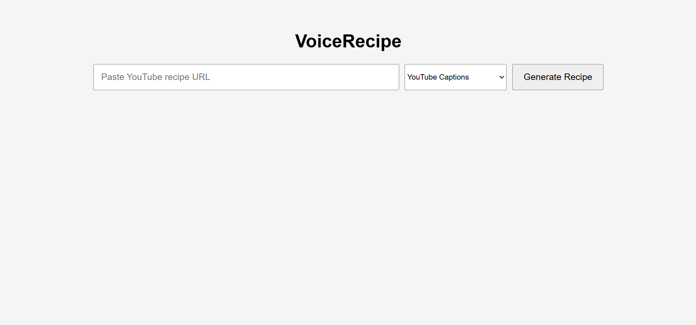
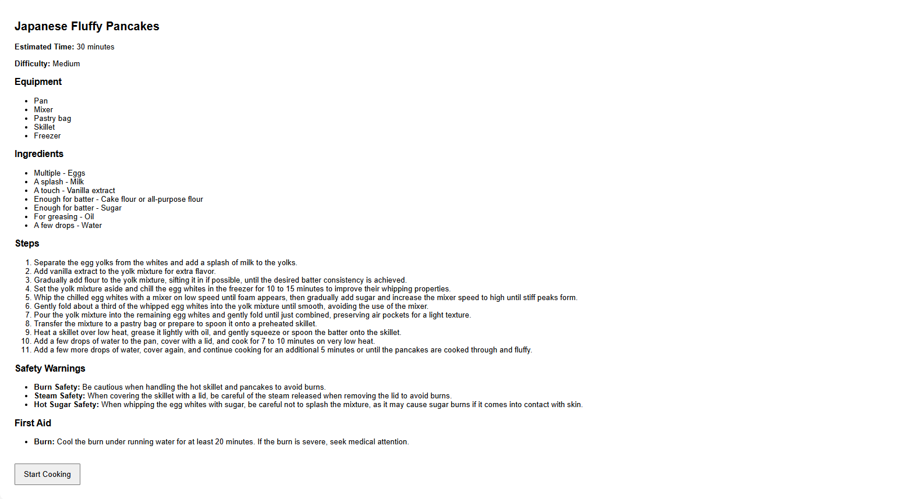
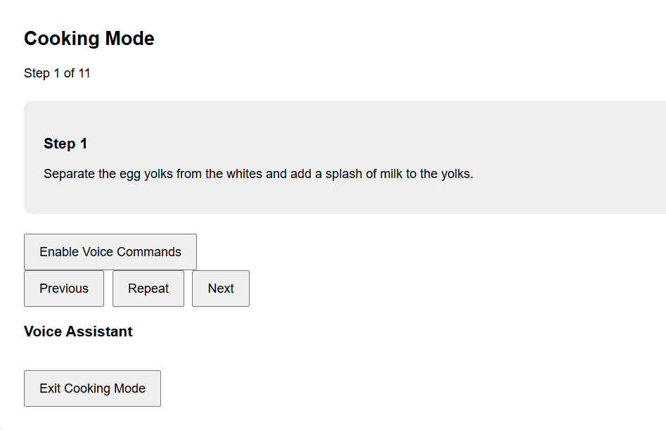

# VoiceRecipe

VoiceRecipe is an AI-powered web application that converts YouTube cooking videos into a guided, hands-free cooking experience using LLMs and voice interaction.

𐙚 Features
Takes YouTube URLs and fetches transcripts to generate a recipe, skipping unnecessary "small talk" segments.
Forms a structured list of ingredients and instructions, along with details such as estimated time and difficulty.
Provides safety instructions relevant to the recipe being followed.

𐙚 Voice Interaction
- Say "next" to go to the next step
- Say "previous" to go to the previous step.
- Say for example, "How many eggs do I have to add again?" 

𐙚 Tech Stack

Frontend
- React
- Vite
- Web Speech API (Speech Recognition + Text-to-Speech)

Backend
- FastAPI
- Python

AI
- Groq API
- Llama 3.3 70B

Other Libraries
- yt-dlp
- youtube-transcript-api
- Faster Whisper (experimental)
  
𐙚 Architecture

YouTube URL
        ↓
Transcript Extraction
        ↓
LLM Recipe Parser
        ↓
Structured JSON Recipe
        ↓
Safety Analysis
        ↓
React Frontend
        ↓
Voice-Controlled Cooking Assistant

𐙚 Screenshots

LANDING PAGE

RECIPE PAGE

COOKING PAGE

𐙚 How to Run

Check requirements.txt

To run locally:
Python
Groq API key
FFmpeg

### Backend Setup

Open a terminal
cd backend
python -m venv venv
venv\Scripts\activate (I used command prompt)
pip install -r requirements.txt

Create a .env file 
GROQ_API_KEY=your_key

To run, type in the command
uvicorn main:app --reload
Changes in the code will be reflected immediately 

### Frontend Setup

Open a new terminal 
cd frontend
npm install
npm run dev

𐙚 Future Improvements

- Some YouTube videos don't have captions --> add Whisper AI integration (or similar)
  This should be able to transcribe recipes other than English as well, increasing accessibility 
- Add proper UI to the landing, recipe, and cooking pages.
- Add cooking timers
- Save favourite recipes

𐙚 Author

Swara Patil

